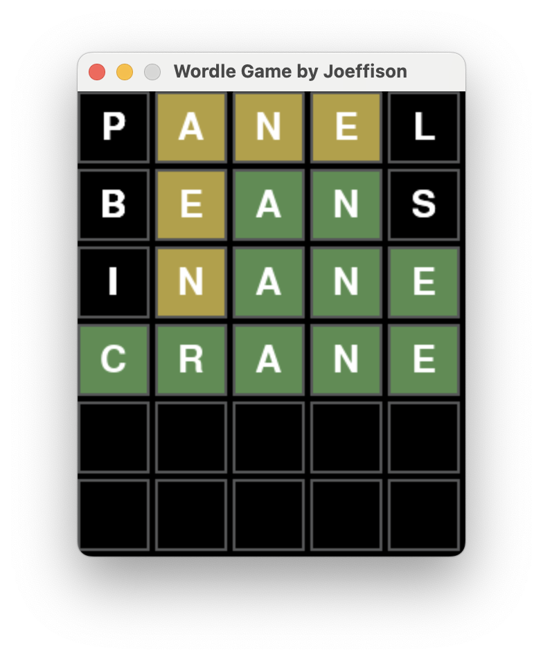

# wordle
Practicing pygame with a very simple game. I also wanted to play wordle more than once a day and decided to implement one myself.

Not licensed for commercial use.


## Setup

### Prerequisites
- asdf (recommended)
  - **note:** alternatively you can install poetry and python yourself,
however in that case you have to check pyproject.toml for the appropriate
python version and you must use `poetry install` instead of `make setup`.


1. install all dependencies and create the virtual environment with
    ```sh
    make setup
    ```

**note:** If you are going to run tests and contribute to this project,
please run the command below instead:
```sh
make setup-dev
```


## How to play

1. Make sure you setup the game (one-time step)
2. run the game with:
    ```sh
    make play
    ```
3. Type a 5-letter word and press enter (&#x23CE;) to guess.
4. If the letter is present in the word but not in the same position,
the letter will be marked with yellow, if the letter is in the right position
it will be marked with green, otherwise it will not change.
5. Continue guessing until you get it right or reach the limit.

Example:



## Contributing

Please reach out to me in case you would like to contribute.
Before you get started, please see [Setup](#setup) for setting up the project.

### testing

1. Run all tests with:
    ```sh
    make test
    ```
